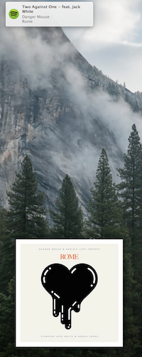

coverfy
=======

Get album art of current Spotify track with AppleScript on OS X.

Based on [Spotify info on the Desktop via NerdTool]( http://www.leancrew.com/all-this/2011/07/spotify-info-on-the-desktop-via-nerdtool/)

Requires `composite` from ImageMagick. Install with `brew install imagemagick --with-libtiff`.

Generate [GeekTool](http://projects.tynsoe.org/en/geektool/) geeklets by running `geektool/generate-geeklets.sh`.
